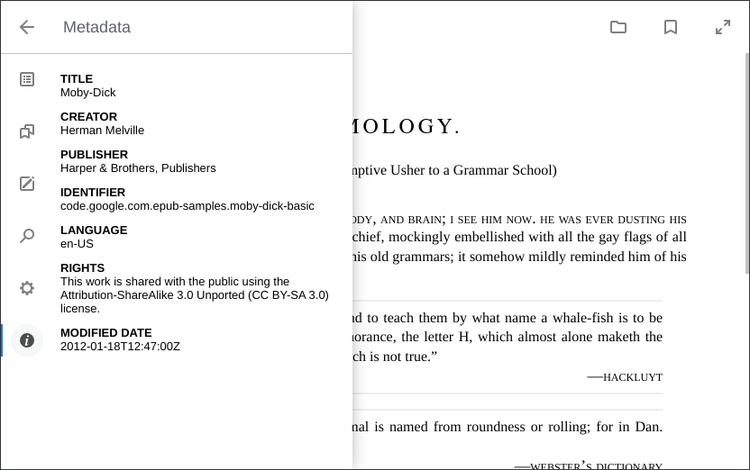

# EpubReader



## About the Reader

The <strong>epubreader</strong> application is based on the <a style="text-decoration: underline;"><strong>epub.js</strong></a> library and is a fork of the <a style="text-decoration: underline;"><strong>epub-reader</strong></a> repository.

## Getting Started

Open up <a style="text-decoration: underline;"><strong>epubreader</strong></a> in a browser.

You can change the ePub it opens by passing a link to <code>bookPath</code> in the url:

<code>?bookPath=https://s3.amazonaws.com/epubjs/books/alice.epub</code>

## Running Locally

Install <a href="https://nodejs.org/en/" style="text-decoration: underline;"><strong>node.js</strong></a>

Then install the project dependencies with <code>npm</code>

```sh
npm install
```

Next you need to clone the repository into local with below command

```sh
git clone <repoUrl>
```

You can run the reader locally with the command

```sh
cd <repo_directory>
npm start
```

The application automatically starts at `localhost:8088`.

Builds are concated and minified using <a href="https://github.com/webpack/webpack" style="text-decoration: underline;">webpack</a>

To generate a new build run

```sh
npm run build
```

or rebuilding all \*.js files

```sh
npm run prepare
```

## Pre-configuration

The <strong>epubreader</strong> application settings is a JavaScript object that you pass an argument to the `Reader` constructor. You can make prelimitary settings in the file <a style="text-decoration: underline;">index.html</a>. For example, this is what the default `Reader` initialization looks like:

```js
<script type="module">
    import { Reader } from "./js/epubreader.min.js"
    const url = new URL(window.location)
    const path = url.searchParams.get("bookPath") || "https://s3.amazonaws.com/moby-dick/"
    window.onload = (e) => new Reader(path)
</script>
```

Let's say we want to disable the `openbook` feature, which is designed to open an epub file on a personal computer. This can be useful for integrating a public library into your site. Let's do this:

```js
<script type="module">
    import { Reader } from "./js/epubreader.min.js"
    const url = "{{bookPath}}"
    window.onload = (e) => new Reader(url, { openbook: false })
</script>
```

> Note that the `{{bookPath}}` replacement token is used to define the `url` string variable. This simple solution will allow you to set up a route to pass the target URL.

## Features
The <strong>epubreader</strong> application supports the following features:
* Initial support for mobile devices
* Saving settings in the browser’s local storage
* Opening a book file from the device’s file system
* Bookmarks
* Annotations
* Search by sections of the book
* Output epub metadata
* <a style="text-decoration: underline;">Keybindings</a>